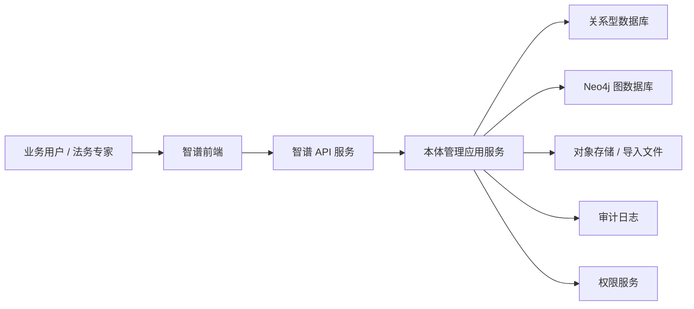
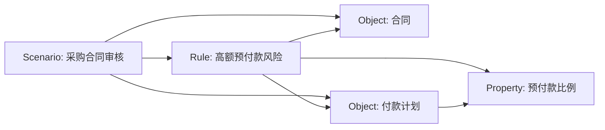

# 传神智谱详细设计

版本: v0.1
日期: 2026-06-05
阶段: 本体管理 MVP

## 1. 设计结论

当前一期需要使用图数据库，但不建议只使用图数据库。

推荐架构是“关系型数据库 + Neo4j 图数据库”的混合存储:

- 关系型数据库负责稳定事务: CRUD 主记录、引用边事实源、权限、版本、审批、审计、导入任务、状态流转。
- Neo4j 负责语义图投影: 对象、关系、行为、属性、场景、规则之间的引用网络、局部图、影响范围分析。
- 前端不暴露 Neo4j、Cypher 或图数据库概念，用户只看到“智谱 / 对象、关系、行为、属性字典、场景、规则”的增删改查。

如果一期团队资源很紧，也可以先用关系型数据库实现全部 CRUD，并用关系表模拟图关系；但从传神智谱的产品本质看，最终仍然建议引入 Neo4j。否则影响范围分析、场景激活元素查询、规则引用链、局部图展示会逐渐变成大量难维护的多表 JOIN。

## 2. 当前一期范围

当前版本只做本体管理，不做合同创建、合同录入、合同审核流转和合同生命周期管理。

当前一期功能:

- 工作台
- 对象管理
- 关系管理
- 行为管理
- 属性字典
- 场景管理
- 规则管理
- 版本记录
- 设置

后续阶段预留:

- 评测
- 推理轨迹
- 语义包
- 调用信息
- 传神智脑正式调用

## 3. 系统架构



### 3.1 前端层

前端提供统一的 B 端 CRUD 操作:

- 列表
- 筛选
- 搜索
- 新增
- 详情
- 编辑
- 删除或停用
- 复制
- 导入
- 导出
- 查看引用
- 查看局部图
- 查看版本

### 3.2 API 层

API 层提供稳定 REST 接口，屏蔽底层图数据库细节。

接口设计原则:

- 所有本体元素都有统一状态字段。
- 所有删除动作先做引用检查。
- 所有编辑动作写入版本快照和审计日志。
- 所有列表支持分页、搜索、状态筛选、更新时间排序。

### 3.3 应用服务层

应用服务层负责业务规则:

- 字段校验
- 编码唯一性校验
- 引用关系校验
- 删除影响范围分析
- 版本生成
- 审计日志记录
- 图投影同步任务生成
- 导入任务解析与错误报告

### 3.4 存储层

关系型数据库作为主库，Neo4j 作为语义关系库。

主库保存:

- 本体空间
- 对象、关系、行为、属性、场景、规则主记录
- 状态、版本、租户、创建人、更新时间
- 审批和审计
- 导入导出任务

Neo4j 保存:

- 本体元素节点
- 本体元素之间的语义引用关系
- 场景激活范围
- 规则引用对象、属性、关系
- 版本快照中的图结构

## 4. 为什么需要图数据库

### 4.1 本体管理天然是图结构

传神智谱管理的不是孤立表单，而是相互引用的语义网络:

- 对象拥有属性。
- 关系连接对象。
- 规则引用对象、关系、属性。
- 场景激活对象、关系、行为和规则。
- 行为引用输入对象、输出对象和前置条件。
- 版本记录需要知道哪些元素发生变化。

这些查询在产品里会频繁出现:

- 删除一个对象前，哪些关系、规则、场景会受影响。
- 一个场景激活了哪些对象、关系、行为和规则。
- 一条规则引用了哪些对象和属性。
- 一个属性改名后，哪些规则需要复核。
- 局部图里展示某个对象的一跳和两跳关系。

这些是图数据库擅长的场景。

### 4.2 但 CRUD 不适合只放在图数据库

只用 Neo4j 做全量业务主库，会让以下能力变复杂:

- 列表分页
- 多条件筛选
- 审批状态流转
- 导入任务
- 审计日志
- 多租户权限
- 后台管理统计
- 与企业已有系统集成

所以推荐混合架构: 关系型库保证业务系统稳定，Neo4j 保证语义关系查询自然。

### 4.3 一期最小可行做法

一期可以按下面方式落地:

1. 关系型数据库保存所有主数据和引用边，作为事实源。
2. 每次新增、编辑、停用本体元素时，在主库事务内写入主记录、引用边和图同步任务。
3. 事务提交后，同步或准实时刷新 Neo4j 图投影。
4. 影响范围、局部图、场景激活元素优先从 Neo4j 查询；如果图投影未同步完成，可回退到主库引用边查询。

## 5. 核心数据模型

### 5.1 通用字段

所有本体元素共用字段:

| 字段 | 类型 | 说明 |
| --- | --- | --- |
| id | string | 全局唯一 ID |
| tenant_id | string | 租户 ID |
| space_id | string | 本体空间 ID |
| code | string | 业务编码，同空间唯一 |
| name | string | 名称 |
| description | text | 自然语言定义 |
| status | enum | draft, pending, active, inactive, deprecated |
| version | int | 当前版本号 |
| created_by | string | 创建人 |
| created_at | datetime | 创建时间 |
| updated_by | string | 更新人 |
| updated_at | datetime | 更新时间 |
| deleted_at | datetime | 软删除时间 |

### 5.2 本体空间 OntologySpace

| 字段 | 类型 | 说明 |
| --- | --- | --- |
| id | string | 空间 ID |
| name | string | 空间名称，如合同审核 |
| code | string | 空间编码 |
| domain | string | 业务域 |
| template_code | string | 初始化模板 |
| status | enum | draft, active, inactive |
| description | text | 空间说明 |

### 5.3 对象 ObjectType

| 字段 | 类型 | 说明 |
| --- | --- | --- |
| id | string | 对象 ID |
| name | string | 对象名称 |
| code | string | 对象编码 |
| aliases | json | 业务别名 |
| description | text | 自然语言定义 |
| examples | json | 示例 |
| status | enum | 状态 |

对象示例:

- Contract
- ContractParty
- Clause
- PaymentPlan
- Obligation
- RiskItem
- ReviewOpinion

### 5.4 属性 Property

| 字段 | 类型 | 说明 |
| --- | --- | --- |
| id | string | 属性 ID |
| object_type_id | string | 所属对象 |
| name | string | 属性名称 |
| code | string | 属性编码 |
| data_type | enum | string, number, boolean, date, enum, text |
| required | boolean | 是否必填 |
| enum_values | json | 枚举值 |
| default_value | string | 默认值 |
| threshold_config | json | 阈值配置 |
| description | text | 字段口径 |

### 5.5 关系 RelationType

| 字段 | 类型 | 说明 |
| --- | --- | --- |
| id | string | 关系 ID |
| name | string | 关系名称 |
| code | string | 关系编码 |
| source_object_id | string | 起点对象 |
| target_object_id | string | 终点对象 |
| direction | enum | source_to_target, bidirectional |
| scenario_condition | text | 场景条件 |
| multi_hop_enabled | boolean | 是否允许多跳使用 |
| examples | json | 示例 |

### 5.6 行为 ActionType

| 字段 | 类型 | 说明 |
| --- | --- | --- |
| id | string | 行为 ID |
| name | string | 行为名称 |
| code | string | 行为编码 |
| input_schema | json | 输入参数 |
| preconditions | text | 前置条件 |
| output_schema | json | 输出结果 |
| side_effects | text | 可能副作用 |
| examples | json | 示例 |

### 5.7 场景 Scenario

| 字段 | 类型 | 说明 |
| --- | --- | --- |
| id | string | 场景 ID |
| name | string | 场景名称 |
| code | string | 场景编码 |
| contract_type | string | 适用合同类型，仅作为本体字段 |
| input_requirements | text | 输入要求 |
| output_requirements | text | 输出要求 |
| description | text | 场景定义 |

### 5.8 规则 Rule

| 字段 | 类型 | 说明 |
| --- | --- | --- |
| id | string | 规则 ID |
| name | string | 规则名称 |
| code | string | 规则编码 |
| risk_category | string | 风险类别 |
| severity | enum | high, medium, low, info |
| condition_text | text | 条件 |
| result_text | text | 结果 |
| examples | json | 已解示例 |
| negative_examples | json | 不适用示例 |
| suggestion_template | text | 输出建议模板 |

### 5.9 引用边 ReferenceEdge

引用边是关系型库中的图关系事实源。Neo4j 是它的查询投影，不是唯一事实源。

| 字段 | 类型 | 说明 |
| --- | --- | --- |
| id | string | 引用边 ID |
| tenant_id | string | 租户 ID |
| space_id | string | 本体空间 ID |
| source_type | string | 起点元素类型 |
| source_id | string | 起点元素 ID |
| edge_type | string | 引用关系类型 |
| target_type | string | 终点元素类型 |
| target_id | string | 终点元素 ID |
| status | enum | active, inactive |
| created_at | datetime | 创建时间 |

常见 edge_type:

- HAS_PROPERTY
- RELATES_FROM
- RELATES_TO
- REFERENCES_OBJECT
- REFERENCES_PROPERTY
- REFERENCES_RELATION
- REFERENCES_ACTION
- ACTIVATES_OBJECT
- ACTIVATES_RELATION
- ACTIVATES_ACTION
- ACTIVATES_RULE

### 5.10 图同步任务 GraphSyncTask

| 字段 | 类型 | 说明 |
| --- | --- | --- |
| id | string | 任务 ID |
| tenant_id | string | 租户 ID |
| space_id | string | 空间 ID |
| resource_type | string | 元素类型 |
| resource_id | string | 元素 ID |
| operation | enum | upsert_node, delete_node, refresh_edges |
| payload | json | 同步内容 |
| status | enum | pending, processing, success, failed |
| retry_count | int | 重试次数 |
| last_error | text | 最近错误 |
| created_at | datetime | 创建时间 |
| updated_at | datetime | 更新时间 |

## 6. Neo4j 图模型

### 6.1 节点标签

| 标签 | 对应实体 |
| --- | --- |
| OntologySpace | 本体空间 |
| ObjectType | 对象 |
| Property | 属性 |
| RelationType | 关系 |
| ActionType | 行为 |
| Scenario | 场景 |
| Rule | 规则 |
| Version | 版本 |

所有节点至少包含:

- id
- tenant_id
- space_id
- code
- name
- status
- version

### 6.2 边类型

| 边类型 | 起点 | 终点 | 说明 |
| --- | --- | --- | --- |
| CONTAINS | OntologySpace | 任一本体元素 | 空间包含元素 |
| HAS_PROPERTY | ObjectType | Property | 对象拥有属性 |
| RELATES_FROM | RelationType | ObjectType | 关系起点对象 |
| RELATES_TO | RelationType | ObjectType | 关系终点对象 |
| REFERENCES_OBJECT | Rule | ObjectType | 规则引用对象 |
| REFERENCES_PROPERTY | Rule | Property | 规则引用属性 |
| REFERENCES_RELATION | Rule | RelationType | 规则引用关系 |
| REFERENCES_ACTION | Rule | ActionType | 规则引用行为 |
| ACTIVATES_OBJECT | Scenario | ObjectType | 场景激活对象 |
| ACTIVATES_RELATION | Scenario | RelationType | 场景激活关系 |
| ACTIVATES_ACTION | Scenario | ActionType | 场景激活行为 |
| ACTIVATES_RULE | Scenario | Rule | 场景激活规则 |
| VERSION_OF | Version | 任一本体元素 | 版本快照关联 |

### 6.3 示例图结构



### 6.4 典型 Cypher 查询

查询对象影响范围:

```cypher
MATCH (target {id: $elementId})
OPTIONAL MATCH (rule:Rule)-[:REFERENCES_OBJECT|REFERENCES_PROPERTY|REFERENCES_RELATION]->(target)
OPTIONAL MATCH (scenario:Scenario)-[:ACTIVATES_OBJECT|ACTIVATES_RELATION|ACTIVATES_RULE]->(target)
RETURN target, collect(DISTINCT rule) AS affectedRules, collect(DISTINCT scenario) AS affectedScenarios
```

查询场景激活元素:

```cypher
MATCH (s:Scenario {id: $scenarioId})
OPTIONAL MATCH (s)-[:ACTIVATES_OBJECT]->(objects:ObjectType)
OPTIONAL MATCH (s)-[:ACTIVATES_RELATION]->(relations:RelationType)
OPTIONAL MATCH (s)-[:ACTIVATES_ACTION]->(actions:ActionType)
OPTIONAL MATCH (s)-[:ACTIVATES_RULE]->(rules:Rule)
RETURN s,
       collect(DISTINCT objects) AS objects,
       collect(DISTINCT relations) AS relations,
       collect(DISTINCT actions) AS actions,
       collect(DISTINCT rules) AS rules
```

查询局部图:

```cypher
MATCH (n {id: $elementId})
MATCH path = (n)-[*1..2]-(m)
WHERE m.space_id = n.space_id
RETURN path
LIMIT 200
```

## 7. CRUD 设计

### 7.1 新增

通用流程:

1. 前端提交表单。
2. API 校验必填字段、编码唯一性、引用对象是否存在。
3. 关系型库写入主记录，状态为 draft。
4. 关系型库写入引用边和图同步任务。
5. 事务提交后刷新 Neo4j 图投影。
6. 写入审计日志。
7. 返回详情。

### 7.2 查看

查看详情时返回:

- 主记录字段
- 引用关系
- 影响范围摘要
- 版本记录
- 局部图数据

### 7.3 编辑

编辑流程:

1. 前端提交变更。
2. API 计算变更字段 diff。
3. 校验引用合法性。
4. 关系型库更新主记录并递增版本。
5. 关系型库更新引用边和图同步任务。
6. 事务提交后刷新 Neo4j 节点属性和边。
7. 写入版本快照。
8. 写入审计日志。

### 7.4 删除或停用

不建议物理删除已被引用元素。

删除流程:

1. 用户点击删除或停用。
2. 系统先查询 Neo4j 影响范围；如果图投影未同步完成，则查询主库引用边。
3. 如果没有引用，可软删除或停用。
4. 如果存在引用，弹出影响范围确认。
5. 用户确认后，仅允许停用；如果是核心引用，可阻断操作。
6. 写入审计日志。

阻断规则:

- 已发布版本中的元素不可物理删除。
- 被 active 场景激活的元素默认不可删除，只能停用并提示风险。
- 被 active 规则引用的对象、属性、关系默认不可删除。

### 7.5 复制

复制流程:

1. 用户点击复制。
2. 系统复制主字段和示例。
3. 编码自动追加后缀，如 `_copy`。
4. 状态设为 draft。
5. 引用关系默认复制，可由用户调整。

### 7.6 导入

一期支持 Excel 或 CSV 导入:

- 对象
- 属性
- 关系
- 行为
- 规则

导入流程:

1. 下载模板。
2. 上传文件。
3. 系统解析并预校验。
4. 展示成功、失败、重复、引用缺失明细。
5. 用户确认导入。
6. 批量写入主库、引用边和图同步任务。
7. 刷新 Neo4j 图投影。
8. 生成导入任务报告。

### 7.7 导出

导出内容:

- 当前列表筛选结果
- 全量本体元素
- 某场景激活元素
- 某版本快照
- 影响范围报告

## 8. API 设计

### 8.1 通用接口规范

列表:

```http
GET /api/ontology/{space_id}/{resource}?keyword=&status=&page=&page_size=
```

详情:

```http
GET /api/ontology/{space_id}/{resource}/{id}
```

新增:

```http
POST /api/ontology/{space_id}/{resource}
```

编辑:

```http
PUT /api/ontology/{space_id}/{resource}/{id}
```

停用:

```http
POST /api/ontology/{space_id}/{resource}/{id}/deactivate
```

复制:

```http
POST /api/ontology/{space_id}/{resource}/{id}/copy
```

影响范围:

```http
GET /api/ontology/{space_id}/{resource}/{id}/impact
```

局部图:

```http
GET /api/ontology/{space_id}/{resource}/{id}/local-graph?depth=1
```

导入:

```http
POST /api/ontology/{space_id}/{resource}/import
```

导出:

```http
GET /api/ontology/{space_id}/{resource}/export
```

### 8.2 resource 取值

- objects
- properties
- relations
- actions
- scenarios
- rules
- versions
- settings

### 8.3 统一响应

```json
{
  "success": true,
  "data": {},
  "error": null,
  "trace_id": "req_123"
}
```

## 9. 版本设计

### 9.1 版本粒度

一期采用元素级版本 + 空间级版本摘要。

- 元素级版本: 对象、关系、行为、属性、场景、规则每次编辑都生成一条版本记录。
- 空间级版本摘要: 当用户提交审核或保存阶段版本时，生成本体空间快照。

### 9.2 版本记录字段

| 字段 | 类型 | 说明 |
| --- | --- | --- |
| id | string | 版本记录 ID |
| space_id | string | 空间 ID |
| resource_type | string | 元素类型 |
| resource_id | string | 元素 ID |
| version | int | 版本号 |
| change_type | enum | create, update, deactivate, copy, import |
| diff | json | 变更内容 |
| snapshot | json | 变更后快照 |
| created_by | string | 操作人 |
| created_at | datetime | 操作时间 |

### 9.3 对比逻辑

版本对比展示:

- 新增字段
- 删除字段
- 修改字段
- 引用关系变化
- 状态变化

## 10. 审计设计

审计日志记录所有关键动作:

- 新增
- 编辑
- 停用
- 复制
- 导入
- 导出
- 提交审核
- 权限变更

审计日志字段:

| 字段 | 类型 | 说明 |
| --- | --- | --- |
| id | string | 日志 ID |
| tenant_id | string | 租户 ID |
| space_id | string | 空间 ID |
| actor_id | string | 操作人 |
| action | string | 操作类型 |
| resource_type | string | 资源类型 |
| resource_id | string | 资源 ID |
| before | json | 操作前 |
| after | json | 操作后 |
| ip | string | IP |
| user_agent | string | 浏览器信息 |
| created_at | datetime | 操作时间 |

## 11. 权限设计

### 11.1 角色

| 角色 | 权限 |
| --- | --- |
| 平台管理员 | 全部权限 |
| 业务管理员 | 对象、关系、行为、属性、场景管理 |
| 法务专家 | 规则管理、场景查看、版本查看 |
| 审核人 | 查看、审批、退回 |
| 查看者 | 只读 |

### 11.2 权限点

- ontology:read
- ontology:create
- ontology:update
- ontology:deactivate
- ontology:copy
- ontology:import
- ontology:export
- ontology:approve
- settings:manage

## 12. 前端页面设计要点

### 12.1 列表页

所有当前一期二级功能都采用统一列表模式:

- 左上角标题
- 右上角新增按钮
- 搜索框
- 状态筛选
- 批量操作
- 表格
- 分页
- 行内操作: 查看、编辑、复制、停用、影响范围

### 12.2 详情抽屉

详情抽屉统一包含:

- 基本信息
- 自然语言定义
- 引用关系
- 示例
- 影响范围
- 版本记录
- 局部图

### 12.3 编辑表单

编辑表单统一包含:

- 基本信息
- 结构化字段
- 自然语言说明
- 引用绑定
- 示例
- 校验结果

## 13. 图投影一致性设计

### 13.1 事实源

关系型库是事实源，保存主记录和 ReferenceEdge。Neo4j 是图查询投影，用于提升引用分析和局部图查询体验。

### 13.2 一期推荐方案

一期推荐“主库事务 + 同步触发图刷新 + 失败可重试”:

1. 开启关系型库事务。
2. 写入主记录。
3. 写入 ReferenceEdge。
4. 写入 GraphSyncTask。
5. 写入版本和审计日志。
6. 提交主库事务。
7. API 服务立即尝试执行 GraphSyncTask，刷新 Neo4j。
8. 如果刷新失败，任务标记为 failed 或 pending_retry，后台重试。

用户体验:

- CRUD 以主库提交为准。
- 图同步失败时，列表和详情不受影响。
- 局部图和影响范围优先查 Neo4j；如果同步失败，回退主库 ReferenceEdge 查询，并提示“图视图同步中”。

### 13.3 后续增强

后续可改为事件驱动:

- 主库先提交。
- 写入 outbox 事件。
- 消费者异步同步 Neo4j。
- 提供同步状态和重试机制。

一期为了简单和可控，先不引入复杂消息队列，但保留 GraphSyncTask 表作为轻量 outbox。

## 14. 初始化模板

合同审核模板初始化内容:

- 默认对象
- 默认属性
- 默认关系
- 默认行为
- 默认场景
- 默认规则

初始化不是创建合同，而是创建本体资产草稿。

初始化流程:

1. 用户选择合同审核模板。
2. 系统展示将创建的本体元素清单。
3. 用户确认。
4. 系统批量创建主库记录。
5. 系统批量创建引用边和图同步任务。
6. 系统刷新 Neo4j 图投影。
7. 生成初始化版本记录。

## 15. 风险与处理

| 风险 | 表现 | 处理 |
| --- | --- | --- |
| 图投影不同步 | 主库有记录，Neo4j 缺边 | 主库 ReferenceEdge 作为事实源，GraphSyncTask 重试修复 |
| 用户误删核心元素 | 规则和场景失效 | 删除前做影响范围分析，默认软删除或停用 |
| 图模型过早复杂 | 开发成本升高 | 一期只建本体元素和引用边，不建实例数据 |
| Neo4j 被前端心智绑架 | 用户以为要操作复杂大图 | 前端只做表格、表单、抽屉和局部图 |
| 规则自然语言不可控 | 条件过长或表达混乱 | 规则编辑器做原子化提示和示例必填 |

## 16. 关键开放问题

1. 一期技术栈中的关系型数据库选 MySQL、PostgreSQL 还是已有企业数据库。
2. Neo4j 是否作为一期必选依赖，还是先用关系表模拟图关系后再切换。
3. 审批流是否一期就做，还是只做状态和审计。
4. 导入模板是否先支持 Excel，还是 CSV 和 Excel 都支持。
5. 本体空间是否一期只允许一个“合同审核”，还是支持多空间。
